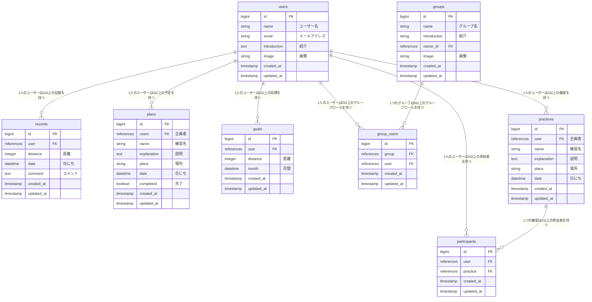

```mermaid
erDiagram
  users ||--o{ records : "1人のユーザーは0以上の記録を持つ"
  users ||--o{ plans : "1人のユーザーは0以上の予定を持つ"
  users ||--o{ goals: "1人のユーザーは0以上の目標を持つ"
  users ||--o{ group_users: "1人のユーザーは0以上のグループロールを持つ"
  groups ||--o{ group_users: "1つのグループは0以上のグループロールを持つ"
  users ||--o{ practices: "1人のユーザーは0以上の練習を持つ"
  users ||--o{ participants: "1人のユーザーは0以上の参加者を持つ" 
  practices ||--o{ participants: "1つの練習は0以上の参加者を持つ"

  users {
    bigint id PK
    string name "ユーザー名"
    string email "メールアドレス"
    text introduction "紹介"
    string image "画像"
    timestamp created_at
    timestamp updated_at
  }

  records {
    bigint id PK
    references user FK
    integer distance "距離"
    datetime date "日にち"
    text comment "コメント"
    timestamp created_at
    timestamp updated_at
  }

  goals {
    bigint id PK
    references user FK
    integer distance "距離"
    datetime month "月間"
    timestamp created_at
    timestamp updated_at
  }

  plans{
   bigint id PK
   references users FK "企画者"
   string name "練習名"
   text explanation "説明"
   string place "場所"
   datetime date "日にち"
   boolean completed "完了"
   timestamp created_at
   timestamp updated_at
  }

  groups{
    bigint id PK
    string name "グループ名"
    string introduction "紹介"
    references owner_id FK
    string image "画像"
    timestamp created_at
    timestamp updated_at
  }

  group_users{
    bigint id PK
    references group FK
    references user FK
    timestamp created_at
    timestamp updated_at
  }

  practices{
    bigint id PK
    references user FK "企画者"
    string name "練習名"
    text explanation "説明"
    string place "場所"
    datetime date "日にち"
    timestamp created_at
    timestamp updated_at
  }

  participants{
    bigint id PK
    references user FK
    references practice FK
    timestamp created_at
    timestamp updated_at
  }
```
